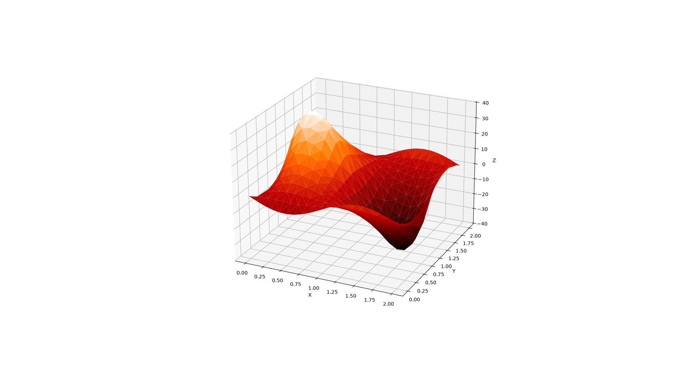

Numerical solver for the Poisson equation with Direchlet boundary conditions in N dimensions using a generalised version of the 5-point finite difference method (which is for 2 dimensional problems).